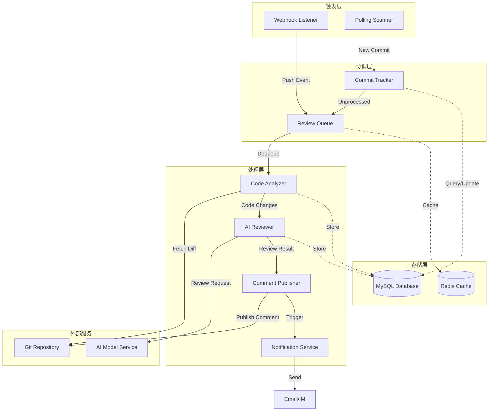

# Design Document: AI 代码审查系统

## Overview

AI 代码审查系统是一个基于 Next.js 的全栈应用，用于自动化代码质量保障。系统通过两种触发模式（Webhook 和主动轮询）监听 UAT 分支的代码提交，调用 AI 大模型进行代码审查，并将结构化的审查建议发布回代码仓库。

### 技术栈评估

用户提出的技术栈：
- **Next.js 16 + React 19**: ✅ 适合，最新版本提供更好的性能和开发体验
- **MySQL**: ✅ 适合，满足结构化数据存储需求（审查记录、配置、提交追踪）
- **pnpm**: ✅ 适合，更快的安装速度和更好的磁盘空间利用
- **Zustand**: ⚠️ 部分适合，对于这个系统，大部分状态管理在服务端，客户端状态较简单

### Router 选择建议

**推荐使用 App Router (`app/`)**

理由：
1. **服务端优先**: 本系统大量使用服务端逻辑（webhook 处理、AI 调用、数据库操作），App Router 的 Server Components 和 Server Actions 更适合
2. **API 路由增强**: App Router 的 Route Handlers 提供更好的 API 设计体验
3. **流式渲染**: 审查历史和统计报告可以利用 Streaming 提升用户体验
4. **未来趋势**: Next.js 16 重点优化 App Router，Pages Router 处于维护模式
5. **类型安全**: App Router 与 TypeScript 集成更好

### 优化后的目录结构

```
ai-code-review-system/
├─ app/                          # App Router 核心
│  ├─ api/                       # API 路由
│  │  ├─ webhook/route.ts        # Webhook 接收端点
│  │  ├─ reviews/route.ts        # 审查记录查询
│  │  └─ config/route.ts         # 配置管理
│  ├─ dashboard/                 # 审查历史仪表板
│  │  ├─ page.tsx
│  │  └─ [reviewId]/page.tsx     # 审查详情页
│  ├─ config/                    # 配置管理页面
│  │  └─ page.tsx
│  ├─ layout.tsx                 # 根布局
│  └─ page.tsx                   # 首页
├─ components/                   # React 组件
│  ├─ ui/                        # 基础 UI 组件
│  ├─ review/                    # 审查相关组件
│  │  ├─ ReviewCard.tsx
│  │  ├─ ReviewDetail.tsx
│  │  └─ ReviewStats.tsx
│  └─ config/                    # 配置相关组件
├─ lib/                          # 核心业务逻辑
│  ├─ services/                  # 服务层
│  │  ├─ webhook-listener.ts     # Webhook 监听器
│  │  ├─ polling-scanner.ts      # 轮询扫描器
│  │  ├─ code-analyzer.ts        # 代码分析器
│  │  ├─ ai-reviewer.ts          # AI 审查器
│  │  ├─ comment-publisher.ts    # 评论发布器
│  │  └─ notification.ts         # 通知服务
│  ├─ db/                        # 数据库
│  │  ├─ client.ts               # MySQL 客户端
│  │  ├─ schema.ts               # 数据库 schema
│  │  └─ repositories/           # 数据访问层
│  │     ├─ review.ts
│  │     ├─ commit-tracker.ts
│  │     └─ config.ts
│  ├─ git/                       # Git 集成
│  │  ├─ client.ts               # Git API 客户端
│  │  └─ diff-parser.ts          # Diff 解析器
│  ├─ ai/                        # AI 模型集成
│  │  ├─ client.ts               # AI 模型客户端
│  │  └─ prompt-builder.ts       # 提示词构建器
│  ├─ queue/                     # 任务队列
│  │  ├─ review-queue.ts         # 审查任务队列
│  │  └─ worker.ts               # 队列处理器
│  └─ utils/                     # 工具函数
│     ├─ crypto.ts               # 加密工具
│     ├─ logger.ts               # 日志工具
│     └─ retry.ts                # 重试逻辑
├─ types/                        # TypeScript 类型
│  ├─ review.ts
│  ├─ git.ts
│  ├─ ai.ts
│  └─ config.ts
├─ hooks/                        # React Hooks
│  ├─ useReviews.ts
│  └─ useConfig.ts
├─ store/                        # 客户端状态管理
│  └─ ui-store.ts                # UI 状态（过滤器、分页等）
├─ config/                       # 应用配置
│  ├─ database.ts
│  ├─ ai-model.ts
│  └─ git.ts
├─ middleware.ts                 # Next.js 中间件
├─ public/                       # 静态资源
└─ tests/                        # 测试
   ├─ unit/                      # 单元测试
   ├─ integration/               # 集成测试
   └─ property/                  # 属性测试
```

主要改进：
1. **采用 App Router 结构**: `app/` 目录替代 `pages/`
2. **服务层清晰分离**: `lib/services/` 包含所有核心业务逻辑
3. **数据访问层**: `lib/db/repositories/` 封装数据库操作
4. **队列系统**: `lib/queue/` 处理并发和异步任务
5. **类型优先**: 独立的 `types/` 目录，便于类型复用
6. **测试分类**: 单元测试、集成测试和属性测试分开

## Architecture

### 系统架构图



### 架构层次

#### 1. 触发层 (Trigger Layer)
- **Webhook Listener**: 接收 Git 仓库的 push 事件
- **Polling Scanner**: 定期主动扫描 Git 仓库新提交

#### 2. 协调层 (Coordination Layer)
- **Review Queue**: 管理审查任务队列，处理并发控制
- **Commit Tracker**: 追踪已处理的提交，防止重复审查

#### 3. 处理层 (Processing Layer)
- **Code Analyzer**: 提取和分析代码变更
- **AI Reviewer**: 调用 AI 模型进行审查
- **Comment Publisher**: 发布审查结果到 Git 仓库
- **Notification Service**: 发送通知给相关人员

#### 4. 存储层 (Storage Layer)
- **MySQL**: 持久化存储审查记录、配置、提交追踪
- **Redis**: 缓存队列状态、临时数据

### 关键设计决策

#### 1. 双触发模式支持
- **Webhook 模式**: 实时响应，适合有公网访问的环境
- **轮询模式**: 主动扫描，适合内网或无法配置 webhook 的环境
- **去重机制**: Commit Tracker 确保同一提交不会被重复处理

#### 2. 队列系统
- 使用 Redis 实现任务队列
- 支持优先级（critical 提交优先处理）
- 并发控制：最多 10 个并发审查任务
- 失败重试：指数退避策略

#### 3. AI 模型集成
- 抽象 AI 客户端接口，支持多种 AI 服务（OpenAI、Claude、本地模型）
- 提示词模板化，支持自定义审查关注点
- 超时和重试机制

#### 4. 安全设计
- Webhook 签名验证
- 最小权限原则（Git token 只读权限 + 评论权限）
- 敏感信息加密存储
- API 访问控制

## Components and Interfaces

### 核心组件

#### 1. Webhook Listener

```typescript
interface WebhookListener {
  /**
   * 处理 webhook 请求
   * @param request - HTTP 请求对象
   * @returns 处理结果
   */
  handleWebhook(request: Request): Promise<WebhookResponse>;
  
  /**
   * 验证 webhook 签名
   * @param payload - 请求体
   * @param signature - 签名
   * @returns 是否有效
   */
  verifySignature(payload: string, signature: string): boolean;
  
  /**
   * 提取提交信息
   * @param payload - webhook payload
   * @returns 提交信息列表
   */
  extractCommits(payload: WebhookPayload): CommitInfo[];
}
```

#### 2. Polling Scanner

```typescript
interface PollingScanner {
  /**
   * 启动轮询扫描
   * @param interval - 扫描间隔（秒）
   */
  start(interval: number): void;
  
  /**
   * 停止轮询扫描
   */
  stop(): void;
  
  /**
   * 执行一次扫描
   * @returns 发现的新提交
   */
  scan(): Promise<CommitInfo[]>;
  
  /**
   * 检查提交是否已处理
   * @param commitHash - 提交哈希
   * @returns 是否已处理
   */
  isProcessed(commitHash: string): Promise<boolean>;
}
```

#### 3. Code Analyzer

```typescript
interface CodeAnalyzer {
  /**
   * 分析代码变更
   * @param commit - 提交信息
   * @returns 分析结果
   */
  analyze(commit: CommitInfo): Promise<AnalysisResult>;
  
  /**
   * 获取代码差异
   * @param commitHash - 提交哈希
   * @returns 差异信息
   */
  getDiff(commitHash: string): Promise<DiffInfo>;
  
  /**
   * 过滤非代码文件
   * @param files - 文件列表
   * @returns 代码文件列表
   */
  filterCodeFiles(files: FileChange[]): FileChange[];
  
  /**
   * 拆分大型差异
   * @param diff - 差异信息
   * @param maxLines - 最大行数
   * @returns 差异批次
   */
  splitDiff(diff: DiffInfo, maxLines: number): DiffBatch[];
}
```

#### 4. AI Reviewer

```typescript
interface AIReviewer {
  /**
   * 审查代码变更
   * @param analysis - 分析结果
   * @param config - 审查配置
   * @returns 审查结果
   */
  review(analysis: AnalysisResult, config: ReviewConfig): Promise<ReviewResult>;
  
  /**
   * 构建审查提示词
   * @param analysis - 分析结果
   * @param config - 审查配置
   * @returns 提示词
   */
  buildPrompt(analysis: AnalysisResult, config: ReviewConfig): string;
  
  /**
   * 解析 AI 响应
   * @param response - AI 响应
   * @returns 结构化审查结果
   */
  parseResponse(response: string): ReviewComment[];
}
```

#### 5. Comment Publisher

```typescript
interface CommentPublisher {
  /**
   * 发布审查结果
   * @param review - 审查结果
   * @param commit - 提交信息
   * @returns 发布结果
   */
  publish(review: ReviewResult, commit: CommitInfo): Promise<PublishResult>;
  
  /**
   * 发布行内评论
   * @param comment - 审查评论
   * @param commit - 提交信息
   * @returns 发布结果
   */
  publishLineComment(comment: ReviewComment, commit: CommitInfo): Promise<void>;
  
  /**
   * 发布摘要评论
   * @param summary - 审查摘要
   * @param commit - 提交信息
   * @returns 发布结果
   */
  publishSummary(summary: ReviewSummary, commit: CommitInfo): Promise<void>;
}
```

#### 6. Review Queue

```typescript
interface ReviewQueue {
  /**
   * 添加审查任务
   * @param task - 审查任务
   * @returns 任务 ID
   */
  enqueue(task: ReviewTask): Promise<string>;
  
  /**
   * 获取下一个任务
   * @returns 审查任务
   */
  dequeue(): Promise<ReviewTask | null>;
  
  /**
   * 获取队列长度
   * @returns 队列长度
   */
  length(): Promise<number>;
  
  /**
   * 标记任务完成
   * @param taskId - 任务 ID
   */
  complete(taskId: string): Promise<void>;
  
  /**
   * 标记任务失败
   * @param taskId - 任务 ID
   * @param error - 错误信息
   */
  fail(taskId: string, error: Error): Promise<void>;
}
```

#### 7. Commit Tracker

```typescript
interface CommitTracker {
  /**
   * 记录已处理的提交
   * @param commitHash - 提交哈希
   * @param metadata - 元数据
   */
  track(commitHash: string, metadata: CommitMetadata): Promise<void>;
  
  /**
   * 检查提交是否已处理
   * @param commitHash - 提交哈希
   * @returns 是否已处理
   */
  isTracked(commitHash: string): Promise<boolean>;
  
  /**
   * 获取最后处理的提交
   * @param branch - 分支名
   * @returns 提交哈希
   */
  getLastProcessed(branch: string): Promise<string | null>;
}
```

### API 端点设计

#### Webhook 端点
```
POST /api/webhook
Content-Type: application/json
X-Hub-Signature-256: sha256=...

{
  "ref": "refs/heads/uat",
  "commits": [
    {
      "id": "abc123",
      "message": "Fix bug",
      "author": {...},
      "timestamp": "2024-01-01T00:00:00Z"
    }
  ]
}

Response: 202 Accepted
{
  "taskId": "task-uuid",
  "message": "Review task queued"
}
```

#### 查询审查记录
```
GET /api/reviews?branch=uat&from=2024-01-01&to=2024-01-31&author=user@example.com

Response: 200 OK
{
  "reviews": [
    {
      "id": "review-uuid",
      "commitHash": "abc123",
      "branch": "uat",
      "author": "user@example.com",
      "timestamp": "2024-01-01T00:00:00Z",
      "summary": {
        "total": 5,
        "critical": 1,
        "major": 2,
        "minor": 1,
        "suggestion": 1
      }
    }
  ],
  "pagination": {
    "page": 1,
    "pageSize": 20,
    "total": 100
  }
}
```

#### 获取审查详情
```
GET /api/reviews/:reviewId

Response: 200 OK
{
  "id": "review-uuid",
  "commitHash": "abc123",
  "comments": [
    {
      "id": "comment-uuid",
      "file": "src/utils.ts",
      "line": 42,
      "severity": "major",
      "message": "Potential null pointer exception",
      "suggestion": "Add null check before accessing property"
    }
  ],
  "summary": {...}
}
```

#### 配置管理
```
GET /api/config

Response: 200 OK
{
  "reviewFocus": ["security", "performance", "readability"],
  "fileWhitelist": ["*.ts", "*.tsx", "*.js", "*.jsx"],
  "ignorePatterns": ["node_modules/**", "dist/**"],
  "aiModel": {
    "provider": "openai",
    "model": "gpt-4",
    "temperature": 0.3
  },
  "polling": {
    "enabled": true,
    "interval": 300
  }
}

PUT /api/config
Content-Type: application/json

{
  "reviewFocus": ["security", "performance"]
}

Response: 200 OK
```

## Data Models

### 数据库 Schema

#### 1. reviews 表
存储审查记录

```sql
CREATE TABLE reviews (
  id VARCHAR(36) PRIMARY KEY,
  commit_hash VARCHAR(40) NOT NULL,
  branch VARCHAR(255) NOT NULL,
  repository VARCHAR(500) NOT NULL,
  author_name VARCHAR(255) NOT NULL,
  author_email VARCHAR(255) NOT NULL,
  files_changed INT NOT NULL,
  lines_added INT NOT NULL,
  lines_deleted INT NOT NULL,
  total_issues INT NOT NULL,
  critical_count INT NOT NULL DEFAULT 0,
  major_count INT NOT NULL DEFAULT 0,
  minor_count INT NOT NULL DEFAULT 0,
  suggestion_count INT NOT NULL DEFAULT 0,
  status ENUM('pending', 'processing', 'completed', 'failed') NOT NULL,
  started_at TIMESTAMP NOT NULL,
  completed_at TIMESTAMP NULL,
  processing_time_ms INT NULL,
  error_message TEXT NULL,
  created_at TIMESTAMP DEFAULT CURRENT_TIMESTAMP,
  updated_at TIMESTAMP DEFAULT CURRENT_TIMESTAMP ON UPDATE CURRENT_TIMESTAMP,
  INDEX idx_commit_hash (commit_hash),
  INDEX idx_branch (branch),
  INDEX idx_author_email (author_email),
  INDEX idx_created_at (created_at),
  INDEX idx_status (status)
) ENGINE=InnoDB DEFAULT CHARSET=utf8mb4 COLLATE=utf8mb4_unicode_ci;
```

#### 2. review_comments 表
存储审查评论

```sql
CREATE TABLE review_comments (
  id VARCHAR(36) PRIMARY KEY,
  review_id VARCHAR(36) NOT NULL,
  file_path VARCHAR(1000) NOT NULL,
  line_number INT NOT NULL,
  severity ENUM('critical', 'major', 'minor', 'suggestion') NOT NULL,
  category VARCHAR(100) NOT NULL,
  message TEXT NOT NULL,
  suggestion TEXT NULL,
  code_snippet TEXT NULL,
  published BOOLEAN DEFAULT FALSE,
  published_at TIMESTAMP NULL,
  created_at TIMESTAMP DEFAULT CURRENT_TIMESTAMP,
  FOREIGN KEY (review_id) REFERENCES reviews(id) ON DELETE CASCADE,
  INDEX idx_review_id (review_id),
  INDEX idx_severity (severity),
  INDEX idx_published (published)
) ENGINE=InnoDB DEFAULT CHARSET=utf8mb4 COLLATE=utf8mb4_unicode_ci;
```

#### 3. commit_tracker 表
追踪已处理的提交

```sql
CREATE TABLE commit_tracker (
  id VARCHAR(36) PRIMARY KEY,
  commit_hash VARCHAR(40) NOT NULL UNIQUE,
  branch VARCHAR(255) NOT NULL,
  repository VARCHAR(500) NOT NULL,
  trigger_source ENUM('webhook', 'polling') NOT NULL,
  processed_at TIMESTAMP NOT NULL,
  review_id VARCHAR(36) NULL,
  created_at TIMESTAMP DEFAULT CURRENT_TIMESTAMP,
  FOREIGN KEY (review_id) REFERENCES reviews(id) ON DELETE SET NULL,
  INDEX idx_commit_hash (commit_hash),
  INDEX idx_branch_repo (branch, repository),
  INDEX idx_processed_at (processed_at)
) ENGINE=InnoDB DEFAULT CHARSET=utf8mb4 COLLATE=utf8mb4_unicode_ci;
```

#### 4. review_config 表
存储审查配置

```sql
CREATE TABLE review_config (
  id VARCHAR(36) PRIMARY KEY,
  repository VARCHAR(500) NOT NULL UNIQUE,
  review_focus JSON NOT NULL,
  file_whitelist JSON NOT NULL,
  ignore_patterns JSON NOT NULL,
  ai_model_config JSON NOT NULL,
  polling_enabled BOOLEAN DEFAULT FALSE,
  polling_interval INT DEFAULT 300,
  notification_config JSON NOT NULL,
  created_at TIMESTAMP DEFAULT CURRENT_TIMESTAMP,
  updated_at TIMESTAMP DEFAULT CURRENT_TIMESTAMP ON UPDATE CURRENT_TIMESTAMP,
  INDEX idx_repository (repository)
) ENGINE=InnoDB DEFAULT CHARSET=utf8mb4 COLLATE=utf8mb4_unicode_ci;
```

#### 5. review_queue 表
存储审查任务队列（备用，主要使用 Redis）

```sql
CREATE TABLE review_queue (
  id VARCHAR(36) PRIMARY KEY,
  commit_hash VARCHAR(40) NOT NULL,
  branch VARCHAR(255) NOT NULL,
  repository VARCHAR(500) NOT NULL,
  priority INT DEFAULT 0,
  status ENUM('queued', 'processing', 'completed', 'failed') NOT NULL,
  retry_count INT DEFAULT 0,
  max_retries INT DEFAULT 3,
  error_message TEXT NULL,
  created_at TIMESTAMP DEFAULT CURRENT_TIMESTAMP,
  started_at TIMESTAMP NULL,
  completed_at TIMESTAMP NULL,
  INDEX idx_status_priority (status, priority DESC),
  INDEX idx_commit_hash (commit_hash),
  INDEX idx_created_at (created_at)
) ENGINE=InnoDB DEFAULT CHARSET=utf8mb4 COLLATE=utf8mb4_unicode_ci;
```

#### 6. notification_log 表
存储通知记录

```sql
CREATE TABLE notification_log (
  id VARCHAR(36) PRIMARY KEY,
  review_id VARCHAR(36) NOT NULL,
  recipient_email VARCHAR(255) NOT NULL,
  notification_type ENUM('email', 'im', 'git_comment') NOT NULL,
  status ENUM('pending', 'sent', 'failed') NOT NULL,
  error_message TEXT NULL,
  sent_at TIMESTAMP NULL,
  created_at TIMESTAMP DEFAULT CURRENT_TIMESTAMP,
  FOREIGN KEY (review_id) REFERENCES reviews(id) ON DELETE CASCADE,
  INDEX idx_review_id (review_id),
  INDEX idx_status (status),
  INDEX idx_created_at (created_at)
) ENGINE=InnoDB DEFAULT CHARSET=utf8mb4 COLLATE=utf8mb4_unicode_ci;
```

### TypeScript 类型定义

#### 核心类型

```typescript
// 提交信息
interface CommitInfo {
  hash: string;
  branch: string;
  repository: string;
  author: {
    name: string;
    email: string;
  };
  message: string;
  timestamp: Date;
  url: string;
}

// 文件变更
interface FileChange {
  path: string;
  language: string;
  additions: number;
  deletions: number;
  patch: string;
}

// 差异信息
interface DiffInfo {
  commitHash: string;
  files: FileChange[];
  totalAdditions: number;
  totalDeletions: number;
}

// 分析结果
interface AnalysisResult {
  commit: CommitInfo;
  diff: DiffInfo;
  batches: DiffBatch[];
}

// 差异批次
interface DiffBatch {
  files: FileChange[];
  lineCount: number;
}

// 审查评论
interface ReviewComment {
  id: string;
  file: string;
  line: number;
  severity: 'critical' | 'major' | 'minor' | 'suggestion';
  category: string;
  message: string;
  suggestion?: string;
  codeSnippet?: string;
}

// 审查摘要
interface ReviewSummary {
  total: number;
  critical: number;
  major: number;
  minor: number;
  suggestion: number;
}

// 审查结果
interface ReviewResult {
  id: string;
  commitHash: string;
  comments: ReviewComment[];
  summary: ReviewSummary;
  processingTimeMs: number;
}

// 审查配置
interface ReviewConfig {
  reviewFocus: string[];
  fileWhitelist: string[];
  ignorePatterns: string[];
  aiModel: {
    provider: string;
    model: string;
    temperature: number;
    maxTokens: number;
  };
  promptTemplate?: string;
}

// 审查任务
interface ReviewTask {
  id: string;
  commit: CommitInfo;
  priority: number;
  retryCount: number;
  maxRetries: number;
  createdAt: Date;
}

// Webhook Payload
interface WebhookPayload {
  ref: string;
  repository: {
    name: string;
    url: string;
  };
  commits: Array<{
    id: string;
    message: string;
    author: {
      name: string;
      email: string;
    };
    timestamp: string;
    url: string;
  }>;
}
```

### Redis 数据结构

#### 队列管理
```
# 审查任务队列（有序集合，按优先级和时间排序）
ZADD review:queue <score> <taskId>

# 任务详情（哈希）
HSET review:task:<taskId> commit_hash <hash>
HSET review:task:<taskId> branch <branch>
HSET review:task:<taskId> priority <priority>
HSET review:task:<taskId> created_at <timestamp>

# 处理中的任务（集合）
SADD review:processing <taskId>

# 提交去重（集合，TTL 24小时）
SADD review:processed:<date> <commitHash>
EXPIRE review:processed:<date> 86400
```

#### 速率限制
```
# AI API 调用限制（计数器，TTL 1分钟）
INCR ai:rate_limit:<minute>
EXPIRE ai:rate_limit:<minute> 60

# 并发控制（计数器）
INCR review:concurrent_count
DECR review:concurrent_count
```

### Redis 连接配置

#### 连接信息
```typescript
// config/redis.ts
export const redisConfig = {
  host: 'localhost',
  port: 6379,
  password: process.env.REDIS_PASSWORD || undefined,
  db: 0,
  retryStrategy: (times: number) => {
    const delay = Math.min(times * 50, 2000);
    return delay;
  },
  maxRetriesPerRequest: 3,
  enableReadyCheck: true,
  enableOfflineQueue: true,
  connectTimeout: 10000,
  lazyConnect: false,
};
```

#### Redis 客户端封装
```typescript
// lib/cache/redis-client.ts
import Redis from 'ioredis';
import { redisConfig } from '@/config/redis';
import { logger } from '@/lib/utils/logger';

class RedisClient {
  private static instance: Redis | null = null;
  private static connecting: Promise<Redis> | null = null;

  /**
   * 获取 Redis 客户端实例（单例模式）
   */
  static async getInstance(): Promise<Redis> {
    if (this.instance && this.instance.status === 'ready') {
      return this.instance;
    }

    if (this.connecting) {
      return this.connecting;
    }

    this.connecting = this.createConnection();
    this.instance = await this.connecting;
    this.connecting = null;

    return this.instance;
  }

  /**
   * 创建 Redis 连接
   */
  private static async createConnection(): Promise<Redis> {
    const client = new Redis(redisConfig);

    client.on('connect', () => {
      logger.info('Redis client connecting', { host: redisConfig.host, port: redisConfig.port });
    });

    client.on('ready', () => {
      logger.info('Redis client ready', { host: redisConfig.host, port: redisConfig.port });
    });

    client.on('error', (error) => {
      logger.error('Redis client error', { error: error.message, stack: error.stack });
    });

    client.on('close', () => {
      logger.warn('Redis client connection closed');
    });

    client.on('reconnecting', (delay: number) => {
      logger.info('Redis client reconnecting', { delay });
    });

    // 等待连接就绪
    await new Promise<void>((resolve, reject) => {
      const timeout = setTimeout(() => {
        reject(new Error('Redis connection timeout'));
      }, redisConfig.connectTimeout);

      client.once('ready', () => {
        clearTimeout(timeout);
        resolve();
      });

      client.once('error', (error) => {
        clearTimeout(timeout);
        reject(error);
      });
    });

    return client;
  }

  /**
   * 关闭 Redis 连接
   */
  static async close(): Promise<void> {
    if (this.instance) {
      await this.instance.quit();
      this.instance = null;
      logger.info('Redis client closed');
    }
  }

  /**
   * 健康检查
   */
  static async healthCheck(): Promise<boolean> {
    try {
      const client = await this.getInstance();
      const result = await client.ping();
      return result === 'PONG';
    } catch (error) {
      logger.error('Redis health check failed', { error });
      return false;
    }
  }
}

export default RedisClient;
```

#### Redis 工具函数
```typescript
// lib/cache/redis-utils.ts
import RedisClient from './redis-client';
import { logger } from '@/lib/utils/logger';

/**
 * 设置缓存（带过期时间）
 */
export async function setCache(
  key: string,
  value: string | object,
  ttlSeconds?: number
): Promise<void> {
  try {
    const client = await RedisClient.getInstance();
    const serialized = typeof value === 'string' ? value : JSON.stringify(value);
    
    if (ttlSeconds) {
      await client.setex(key, ttlSeconds, serialized);
    } else {
      await client.set(key, serialized);
    }
    
    logger.debug('Cache set', { key, ttl: ttlSeconds });
  } catch (error) {
    logger.error('Failed to set cache', { key, error });
    throw error;
  }
}

/**
 * 获取缓存
 */
export async function getCache<T = string>(key: string, parseJson = false): Promise<T | null> {
  try {
    const client = await RedisClient.getInstance();
    const value = await client.get(key);
    
    if (!value) {
      return null;
    }
    
    if (parseJson) {
      return JSON.parse(value) as T;
    }
    
    return value as T;
  } catch (error) {
    logger.error('Failed to get cache', { key, error });
    return null;
  }
}

/**
 * 删除缓存
 */
export async function deleteCache(key: string): Promise<void> {
  try {
    const client = await RedisClient.getInstance();
    await client.del(key);
    logger.debug('Cache deleted', { key });
  } catch (error) {
    logger.error('Failed to delete cache', { key, error });
    throw error;
  }
}

/**
 * 批量删除缓存（支持模式匹配）
 */
export async function deleteCachePattern(pattern: string): Promise<number> {
  try {
    const client = await RedisClient.getInstance();
    const keys = await client.keys(pattern);
    
    if (keys.length === 0) {
      return 0;
    }
    
    const deleted = await client.del(...keys);
    logger.debug('Cache pattern deleted', { pattern, count: deleted });
    return deleted;
  } catch (error) {
    logger.error('Failed to delete cache pattern', { pattern, error });
    throw error;
  }
}

/**
 * 检查缓存是否存在
 */
export async function cacheExists(key: string): Promise<boolean> {
  try {
    const client = await RedisClient.getInstance();
    const exists = await client.exists(key);
    return exists === 1;
  } catch (error) {
    logger.error('Failed to check cache existence', { key, error });
    return false;
  }
}
```

## 统一 API 响应封装

### 响应格式标准

所有 API 端点遵循统一的响应格式，避免重复组装响应结构。

#### 标准响应格式
```typescript
// types/api.ts
export interface ApiResponse<T = any> {
  code: number;           // 业务状态码
  msg: string;            // 响应消息
  data: T | null;         // 响应数据
  timestamp: number;      // 时间戳
  requestId?: string;     // 请求追踪 ID
}

export interface PaginatedResponse<T> {
  items: T[];
  pagination: {
    page: number;
    pageSize: number;
    total: number;
    totalPages: number;
  };
}

export interface ErrorDetail {
  field?: string;
  message: string;
  code?: string;
}
```

#### 业务状态码定义
```typescript
// lib/constants/api-codes.ts
export const ApiCode = {
  // 成功
  SUCCESS: 0,
  
  // 客户端错误 (1xxx)
  BAD_REQUEST: 1000,
  UNAUTHORIZED: 1001,
  FORBIDDEN: 1003,
  NOT_FOUND: 1004,
  VALIDATION_ERROR: 1005,
  RATE_LIMIT_EXCEEDED: 1006,
  
  // 服务端错误 (2xxx)
  INTERNAL_ERROR: 2000,
  DATABASE_ERROR: 2001,
  REDIS_ERROR: 2002,
  AI_SERVICE_ERROR: 2003,
  GIT_SERVICE_ERROR: 2004,
  QUEUE_ERROR: 2005,
  
  // 业务错误 (3xxx)
  REVIEW_NOT_FOUND: 3001,
  COMMIT_ALREADY_PROCESSED: 3002,
  INVALID_WEBHOOK_SIGNATURE: 3003,
  REVIEW_IN_PROGRESS: 3004,
  CONFIG_NOT_FOUND: 3005,
} as const;

export const ApiMessage: Record<number, string> = {
  [ApiCode.SUCCESS]: '操作成功',
  [ApiCode.BAD_REQUEST]: '请求参数错误',
  [ApiCode.UNAUTHORIZED]: '未授权访问',
  [ApiCode.FORBIDDEN]: '禁止访问',
  [ApiCode.NOT_FOUND]: '资源不存在',
  [ApiCode.VALIDATION_ERROR]: '数据验证失败',
  [ApiCode.RATE_LIMIT_EXCEEDED]: '请求频率超限',
  [ApiCode.INTERNAL_ERROR]: '服务器内部错误',
  [ApiCode.DATABASE_ERROR]: '数据库错误',
  [ApiCode.REDIS_ERROR]: 'Redis 错误',
  [ApiCode.AI_SERVICE_ERROR]: 'AI 服务错误',
  [ApiCode.GIT_SERVICE_ERROR]: 'Git 服务错误',
  [ApiCode.QUEUE_ERROR]: '队列服务错误',
  [ApiCode.REVIEW_NOT_FOUND]: '审查记录不存在',
  [ApiCode.COMMIT_ALREADY_PROCESSED]: '提交已被处理',
  [ApiCode.INVALID_WEBHOOK_SIGNATURE]: 'Webhook 签名无效',
  [ApiCode.REVIEW_IN_PROGRESS]: '审查正在进行中',
  [ApiCode.CONFIG_NOT_FOUND]: '配置不存在',
};
```

#### 响应工具函数
```typescript
// lib/utils/api-response.ts
import { NextResponse } from 'next/server';
import { ApiResponse, PaginatedResponse, ErrorDetail } from '@/types/api';
import { ApiCode, ApiMessage } from '@/lib/constants/api-codes';
import { v4 as uuidv4 } from 'uuid';

/**
 * 创建成功响应
 */
export function successResponse<T>(
  data: T,
  message?: string,
  statusCode = 200
): NextResponse<ApiResponse<T>> {
  const response: ApiResponse<T> = {
    code: ApiCode.SUCCESS,
    msg: message || ApiMessage[ApiCode.SUCCESS],
    data,
    timestamp: Date.now(),
    requestId: uuidv4(),
  };

  return NextResponse.json(response, { status: statusCode });
}

/**
 * 创建分页成功响应
 */
export function paginatedResponse<T>(
  items: T[],
  page: number,
  pageSize: number,
  total: number,
  message?: string
): NextResponse<ApiResponse<PaginatedResponse<T>>> {
  const data: PaginatedResponse<T> = {
    items,
    pagination: {
      page,
      pageSize,
      total,
      totalPages: Math.ceil(total / pageSize),
    },
  };

  return successResponse(data, message);
}

/**
 * 创建错误响应
 */
export function errorResponse(
  code: number,
  message?: string,
  statusCode?: number,
  details?: ErrorDetail[]
): NextResponse<ApiResponse<null>> {
  const response: ApiResponse<null> = {
    code,
    msg: message || ApiMessage[code] || '未知错误',
    data: details ? { errors: details } : null,
    timestamp: Date.now(),
    requestId: uuidv4(),
  };

  // 根据业务状态码映射 HTTP 状态码
  const httpStatus = statusCode || mapCodeToHttpStatus(code);

  return NextResponse.json(response, { status: httpStatus });
}

/**
 * 创建验证错误响应
 */
export function validationErrorResponse(
  errors: ErrorDetail[]
): NextResponse<ApiResponse<null>> {
  return errorResponse(
    ApiCode.VALIDATION_ERROR,
    ApiMessage[ApiCode.VALIDATION_ERROR],
    400,
    errors
  );
}

/**
 * 创建未授权响应
 */
export function unauthorizedResponse(
  message?: string
): NextResponse<ApiResponse<null>> {
  return errorResponse(
    ApiCode.UNAUTHORIZED,
    message || ApiMessage[ApiCode.UNAUTHORIZED],
    401
  );
}

/**
 * 创建禁止访问响应
 */
export function forbiddenResponse(
  message?: string
): NextResponse<ApiResponse<null>> {
  return errorResponse(
    ApiCode.FORBIDDEN,
    message || ApiMessage[ApiCode.FORBIDDEN],
    403
  );
}

/**
 * 创建资源不存在响应
 */
export function notFoundResponse(
  message?: string
): NextResponse<ApiResponse<null>> {
  return errorResponse(
    ApiCode.NOT_FOUND,
    message || ApiMessage[ApiCode.NOT_FOUND],
    404
  );
}

/**
 * 创建服务器错误响应
 */
export function internalErrorResponse(
  message?: string,
  code = ApiCode.INTERNAL_ERROR
): NextResponse<ApiResponse<null>> {
  return errorResponse(
    code,
    message || ApiMessage[code],
    500
  );
}

/**
 * 映射业务状态码到 HTTP 状态码
 */
function mapCodeToHttpStatus(code: number): number {
  if (code === ApiCode.SUCCESS) return 200;
  if (code >= 1000 && code < 2000) {
    // 客户端错误
    if (code === ApiCode.UNAUTHORIZED) return 401;
    if (code === ApiCode.FORBIDDEN) return 403;
    if (code === ApiCode.NOT_FOUND) return 404;
    if (code === ApiCode.RATE_LIMIT_EXCEEDED) return 429;
    return 400;
  }
  if (code >= 2000 && code < 4000) {
    // 服务端错误
    return 500;
  }
  return 500;
}

/**
 * 异常处理包装器
 */
export async function handleApiRequest<T>(
  handler: () => Promise<T>,
  errorMessage?: string
): Promise<NextResponse<ApiResponse<T | null>>> {
  try {
    const result = await handler();
    return successResponse(result);
  } catch (error) {
    console.error('API request error:', error);
    
    if (error instanceof ApiError) {
      return errorResponse(error.code, error.message, error.statusCode);
    }
    
    return internalErrorResponse(
      errorMessage || (error instanceof Error ? error.message : '未知错误')
    );
  }
}

/**
 * 自定义 API 错误类
 */
export class ApiError extends Error {
  constructor(
    public code: number,
    message: string,
    public statusCode?: number,
    public details?: ErrorDetail[]
  ) {
    super(message);
    this.name = 'ApiError';
  }
}
```

#### 使用示例
```typescript
// app/api/reviews/route.ts
import { NextRequest } from 'next/server';
import { successResponse, errorResponse, paginatedResponse, handleApiRequest } from '@/lib/utils/api-response';
import { ApiCode } from '@/lib/constants/api-codes';
import { getReviews } from '@/lib/db/repositories/review';

export async function GET(request: NextRequest) {
  return handleApiRequest(async () => {
    const searchParams = request.nextUrl.searchParams;
    const page = parseInt(searchParams.get('page') || '1');
    const pageSize = parseInt(searchParams.get('pageSize') || '20');
    const branch = searchParams.get('branch');

    if (!branch) {
      throw new ApiError(ApiCode.BAD_REQUEST, '缺少 branch 参数');
    }

    const { items, total } = await getReviews({ branch, page, pageSize });
    
    return paginatedResponse(items, page, pageSize, total);
  });
}

// app/api/reviews/[reviewId]/route.ts
export async function GET(
  request: NextRequest,
  { params }: { params: { reviewId: string } }
) {
  return handleApiRequest(async () => {
    const review = await getReviewById(params.reviewId);
    
    if (!review) {
      throw new ApiError(ApiCode.REVIEW_NOT_FOUND, '审查记录不存在', 404);
    }
    
    return successResponse(review);
  });
}
```

## 日志记录系统

### 日志架构设计

系统采用结构化日志记录，支持多级别日志、上下文追踪和灵活的输出目标。

#### 日志级别定义
```typescript
// lib/utils/logger.ts
export enum LogLevel {
  DEBUG = 'debug',
  INFO = 'info',
  WARN = 'warn',
  ERROR = 'error',
}

export const LogLevelPriority: Record<LogLevel, number> = {
  [LogLevel.DEBUG]: 0,
  [LogLevel.INFO]: 1,
  [LogLevel.WARN]: 2,
  [LogLevel.ERROR]: 3,
};
```

#### 日志配置
```typescript
// config/logger.ts
import { LogLevel } from '@/lib/utils/logger';

export const loggerConfig = {
  level: (process.env.LOG_LEVEL as LogLevel) || LogLevel.INFO,
  
  // 开发环境：彩色输出到控制台
  // 生产环境：JSON 格式输出
  format: process.env.NODE_ENV === 'production' ? 'json' : 'pretty',
  
  // 日志文件配置
  file: {
    enabled: process.env.LOG_FILE_ENABLED === 'true',
    path: process.env.LOG_FILE_PATH || './logs',
    maxSize: '20m',
    maxFiles: 10,
  },
  
  // 是否包含堆栈跟踪
  includeStack: process.env.NODE_ENV !== 'production',
  
  // 敏感字段脱敏
  redactFields: ['password', 'token', 'apiKey', 'secret'],
};
```

#### Logger 实现
```typescript
// lib/utils/logger.ts
import winston from 'winston';
import { loggerConfig } from '@/config/logger';

const { combine, timestamp, printf, colorize, json, errors } = winston.format;

/**
 * 自定义日志格式（Pretty）
 */
const prettyFormat = printf(({ level, message, timestamp, ...metadata }) => {
  let msg = `${timestamp} [${level}]: ${message}`;
  
  if (Object.keys(metadata).length > 0) {
    msg += `\n${JSON.stringify(metadata, null, 2)}`;
  }
  
  return msg;
});

/**
 * 脱敏处理
 */
const redactFormat = winston.format((info) => {
  const redacted = { ...info };
  
  function redactObject(obj: any): any {
    if (typeof obj !== 'object' || obj === null) {
      return obj;
    }
    
    for (const key in obj) {
      if (loggerConfig.redactFields.includes(key)) {
        obj[key] = '***REDACTED***';
      } else if (typeof obj[key] === 'object') {
        obj[key] = redactObject(obj[key]);
      }
    }
    
    return obj;
  }
  
  return redactObject(redacted);
})();

/**
 * 创建 Winston Logger
 */
const createWinstonLogger = () => {
  const transports: winston.transport[] = [
    new winston.transports.Console({
      format: loggerConfig.format === 'json'
        ? combine(timestamp(), json())
        : combine(
            colorize(),
            timestamp({ format: 'YYYY-MM-DD HH:mm:ss' }),
            prettyFormat
          ),
    }),
  ];

  // 添加文件传输（如果启用）
  if (loggerConfig.file.enabled) {
    transports.push(
      new winston.transports.File({
        filename: `${loggerConfig.file.path}/error.log`,
        level: 'error',
        maxsize: parseSize(loggerConfig.file.maxSize),
        maxFiles: loggerConfig.file.maxFiles,
      }),
      new winston.transports.File({
        filename: `${loggerConfig.file.path}/combined.log`,
        maxsize: parseSize(loggerConfig.file.maxSize),
        maxFiles: loggerConfig.file.maxFiles,
      })
    );
  }

  return winston.createLogger({
    level: loggerConfig.level,
    format: combine(
      errors({ stack: loggerConfig.includeStack }),
      redactFormat,
      timestamp()
    ),
    transports,
    exitOnError: false,
  });
};

/**
 * 解析文件大小字符串
 */
function parseSize(size: string): number {
  const units: Record<string, number> = {
    b: 1,
    k: 1024,
    m: 1024 * 1024,
    g: 1024 * 1024 * 1024,
  };
  
  const match = size.toLowerCase().match(/^(\d+)([bkmg])$/);
  if (!match) return 10 * 1024 * 1024; // 默认 10MB
  
  return parseInt(match[1]) * units[match[2]];
}

/**
 * Logger 类
 */
class Logger {
  private winston: winston.Logger;
  private context: Record<string, any> = {};

  constructor() {
    this.winston = createWinstonLogger();
  }

  /**
   * 设置全局上下文
   */
  setContext(context: Record<string, any>): void {
    this.context = { ...this.context, ...context };
  }

  /**
   * 清除全局上下文
   */
  clearContext(): void {
    this.context = {};
  }

  /**
   * 创建子 Logger（带上下文）
   */
  child(context: Record<string, any>): Logger {
    const childLogger = new Logger();
    childLogger.context = { ...this.context, ...context };
    return childLogger;
  }

  /**
   * Debug 日志
   */
  debug(message: string, meta?: Record<string, any>): void {
    this.log(LogLevel.DEBUG, message, meta);
  }

  /**
   * Info 日志
   */
  info(message: string, meta?: Record<string, any>): void {
    this.log(LogLevel.INFO, message, meta);
  }

  /**
   * Warn 日志
   */
  warn(message: string, meta?: Record<string, any>): void {
    this.log(LogLevel.WARN, message, meta);
  }

  /**
   * Error 日志
   */
  error(message: string, meta?: Record<string, any> | Error): void {
    if (meta instanceof Error) {
      this.log(LogLevel.ERROR, message, {
        error: meta.message,
        stack: meta.stack,
      });
    } else {
      this.log(LogLevel.ERROR, message, meta);
    }
  }

  /**
   * 通用日志方法
   */
  private log(level: LogLevel, message: string, meta?: Record<string, any>): void {
    const logData = {
      ...this.context,
      ...meta,
    };

    this.winston.log(level, message, logData);
  }

  /**
   * 性能计时器
   */
  startTimer(label: string): () => void {
    const start = Date.now();
    return () => {
      const duration = Date.now() - start;
      this.info(`${label} completed`, { duration: `${duration}ms` });
    };
  }
}

/**
 * 导出单例 Logger
 */
export const logger = new Logger();

/**
 * 请求日志中间件辅助函数
 */
export function createRequestLogger(requestId: string, method: string, url: string): Logger {
  return logger.child({
    requestId,
    method,
    url,
  });
}
```

#### 使用示例
```typescript
// app/api/webhook/route.ts
import { NextRequest } from 'next/server';
import { logger, createRequestLogger } from '@/lib/utils/logger';
import { v4 as uuidv4 } from 'uuid';

export async function POST(request: NextRequest) {
  const requestId = uuidv4();
  const reqLogger = createRequestLogger(requestId, 'POST', '/api/webhook');
  
  reqLogger.info('Webhook request received');
  
  try {
    const payload = await request.json();
    reqLogger.debug('Webhook payload parsed', { commits: payload.commits?.length });
    
    // 处理逻辑...
    
    reqLogger.info('Webhook processed successfully', { taskId: 'task-123' });
    return successResponse({ taskId: 'task-123' });
    
  } catch (error) {
    reqLogger.error('Webhook processing failed', error as Error);
    return internalErrorResponse();
  }
}

// lib/services/ai-reviewer.ts
import { logger } from '@/lib/utils/logger';

export class AIReviewer {
  private logger = logger.child({ service: 'AIReviewer' });

  async review(analysis: AnalysisResult): Promise<ReviewResult> {
    const endTimer = this.logger.startTimer('AI review');
    
    this.logger.info('Starting AI review', {
      commitHash: analysis.commit.hash,
      filesCount: analysis.diff.files.length,
    });
    
    try {
      // AI 调用逻辑...
      const result = await this.callAI(analysis);
      
      this.logger.info('AI review completed', {
        commitHash: analysis.commit.hash,
        issuesFound: result.summary.total,
      });
      
      endTimer();
      return result;
      
    } catch (error) {
      this.logger.error('AI review failed', {
        commitHash: analysis.commit.hash,
        error,
      });
      throw error;
    }
  }
}
```

#### 日志查询和分析

对于生产环境，建议集成日志聚合工具：

```typescript
// scripts/analyze-logs.ts
/**
 * 日志分析脚本示例
 * 
 * 使用方式：
 * - 本地开发：直接查看控制台输出
 * - 生产环境：使用 ELK Stack、Datadog、CloudWatch 等工具
 */

// 查询错误日志
// grep "ERROR" logs/combined.log | jq '.message, .error'

// 查询特定请求
// grep "requestId: abc-123" logs/combined.log | jq '.'

// 统计错误类型
// grep "ERROR" logs/combined.log | jq -r '.error' | sort | uniq -c | sort -rn
```

